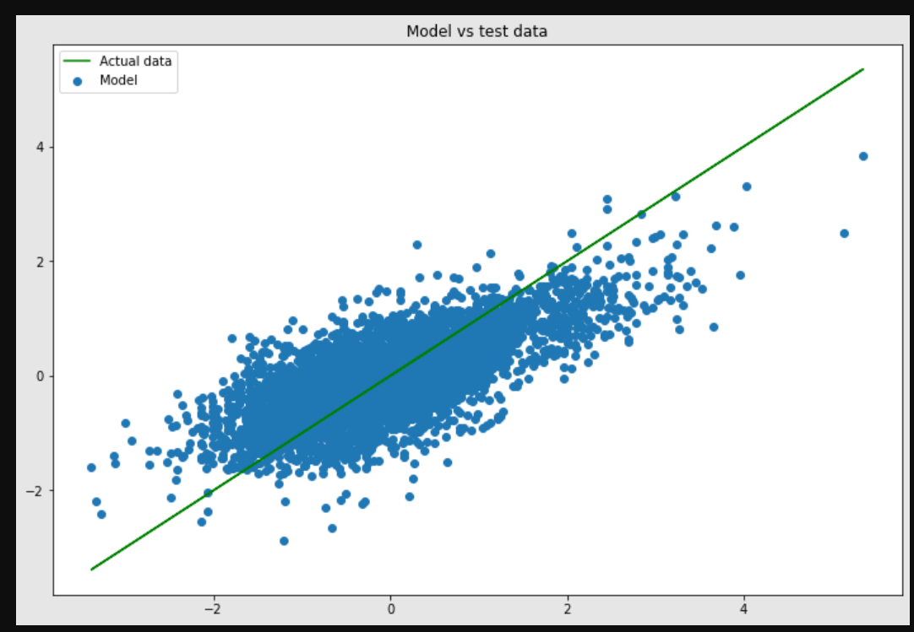
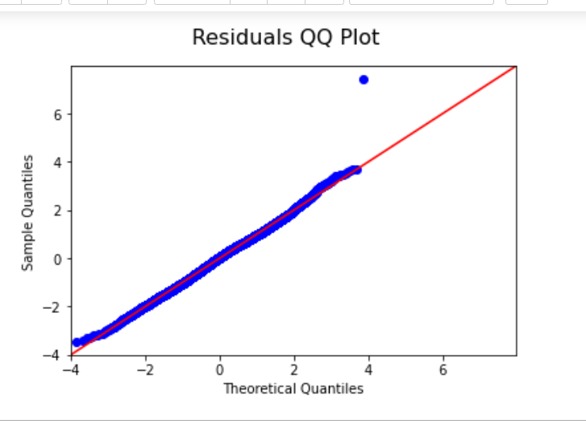
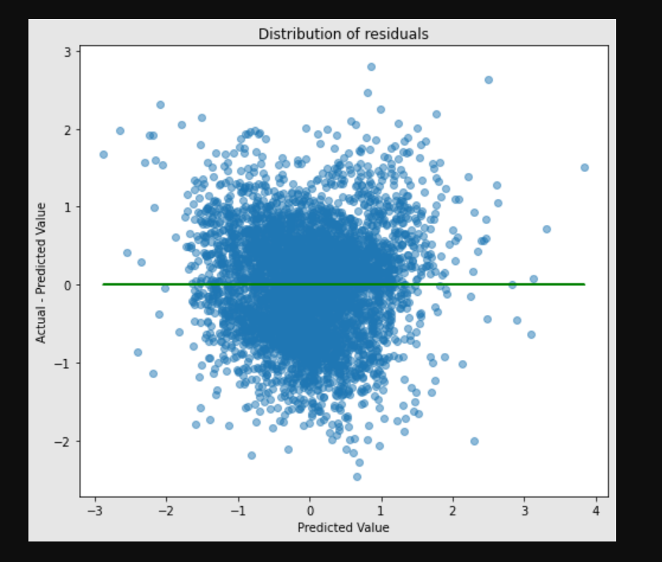

# Phase 2 Project - King county house sales

## Business background

Kings County Housing Authority provides rental housing and assistance to more than 55,000 people. This quality, affordable housing supports health and self‑sufficiency.
serves to provide innovative, effective, and equitable housing solutions so that all people and communities can prosper. Their vision is that all residents of King County have quality affordable housing
KCHA owns 137 properties with 11,582 units including 4,284 units of subsidized housing for families, the elderly, and disabled people.

## Business Problem

Predicting the sale price of properties is always important and often a challenging problem. We want to build a model that can determine the prices of a given house according to a number of features. We will use a subset of the data for training and the remaining for testing our modeling.

## The Data
This project uses the King County House Sales dataset, which can be found in  `kc_house_data.csv`

## Methods/technologies used
* data mining
* data understanding
* data cleaning
* data visualization
* modeling
* analysis

### Results

* assumption on linearity

* assumption on normality

* assumption on homoscedascity

## Conclusions
This project was driven by the need to understand how different features influence the price of houses. We investigated the price of houses with varied features. We found that as the amenities increased the price also increased. We observed houses in King County were priced high for providing people with special amenities like the waterfront.
The model is best suit because it follows the linearity and normality and doesnt violate homoscedascity

# Recommendations
 The top features to determine the value of houses are:

1. Square footage of the house 

The square footage of the living area is the second most important feature when determining the sales price. The larger space of living area, the higher sales price of the house. 

2. Square footage of lot and its nearest 15 neighbors

The square footage of the lot is another key feature when determining the value of house. Based on our model, the larger size of the lot will lead to a higher sales price. Home buyers often prefer properties that allow for easy indoor-outdoor living and provide level areas for children, pets and gardening.

However, interestingly, the large size of the lot for its nearest 15 neighbors will draw down the sales price. It might because the property tax is assessed on the lot size of the house and its neighbors. Too large lotsize might lead to higher property tax.

4. Waterfront: whether the house has a view to a waterfront

The houses with waterfront view have a higher sales price than those without waterfront view.